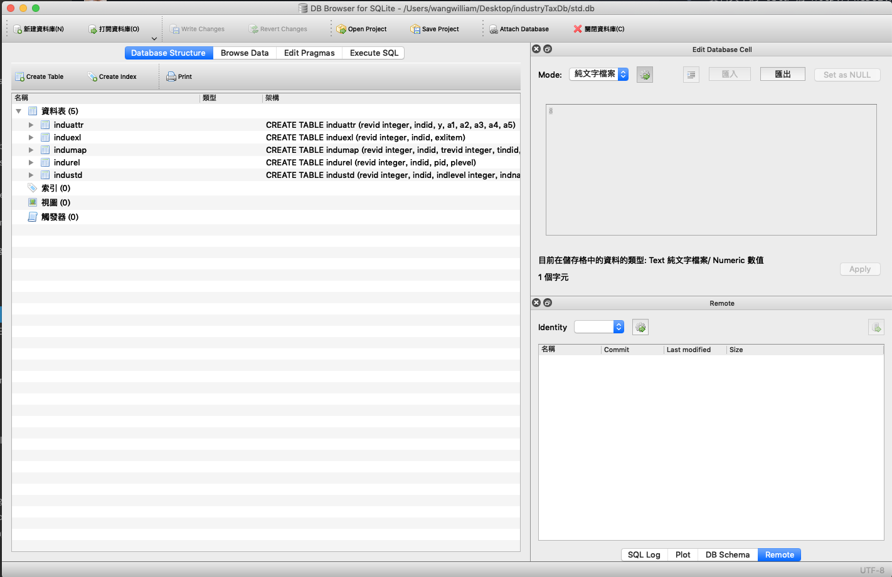
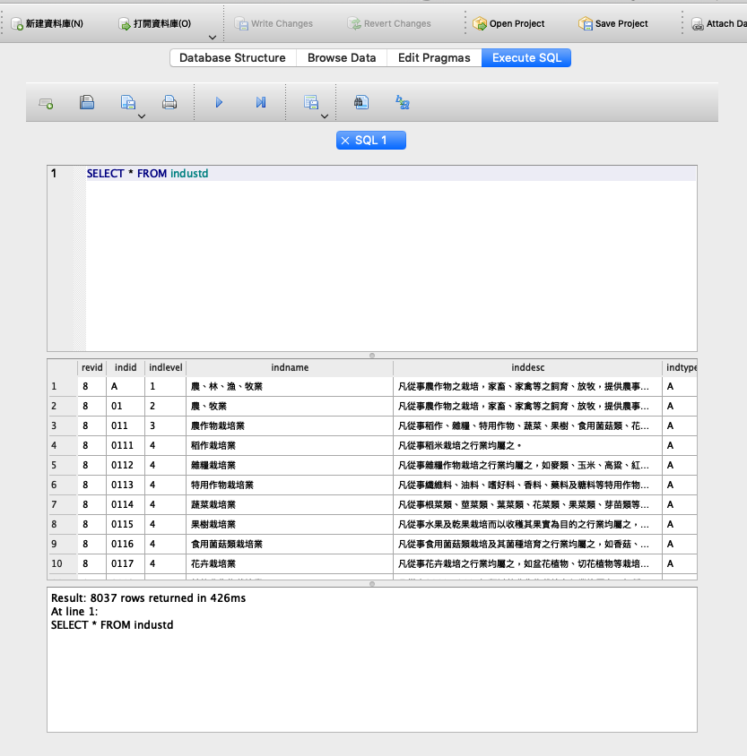

## Industry Tax DB

資料夾中的 lstd 為 http://web02.mof.gov.tw/std/sa.htm 中所下載的單機版 （http://service.mof.gov.tw/public/Data/statistic/class/lstd.zip）。

該單機版透過 html5 Web SQL Database 所建立，關於初始化 DB 的部分放在 `lstd/load.htm` 之中。

這個 Repo 透過使用 `websql` 把原有執行在 web browser 環境中的 script 在 nodejs 環境中執行，並將 DB 轉換成 sqllite 並儲存於檔案 `std.db` 中，

後續更新可直接 fork 這個 repo 更換 db.js 內的資料集後重新執行 `node index.js` 即可取得新版 DB。

user 可以使用 sqllite browser (https://sqlitebrowser.org/) 直接開啟 `std.db` 並進行操作。

開啟結果如下：

並可執行 SQL 後匯出所需結果：

